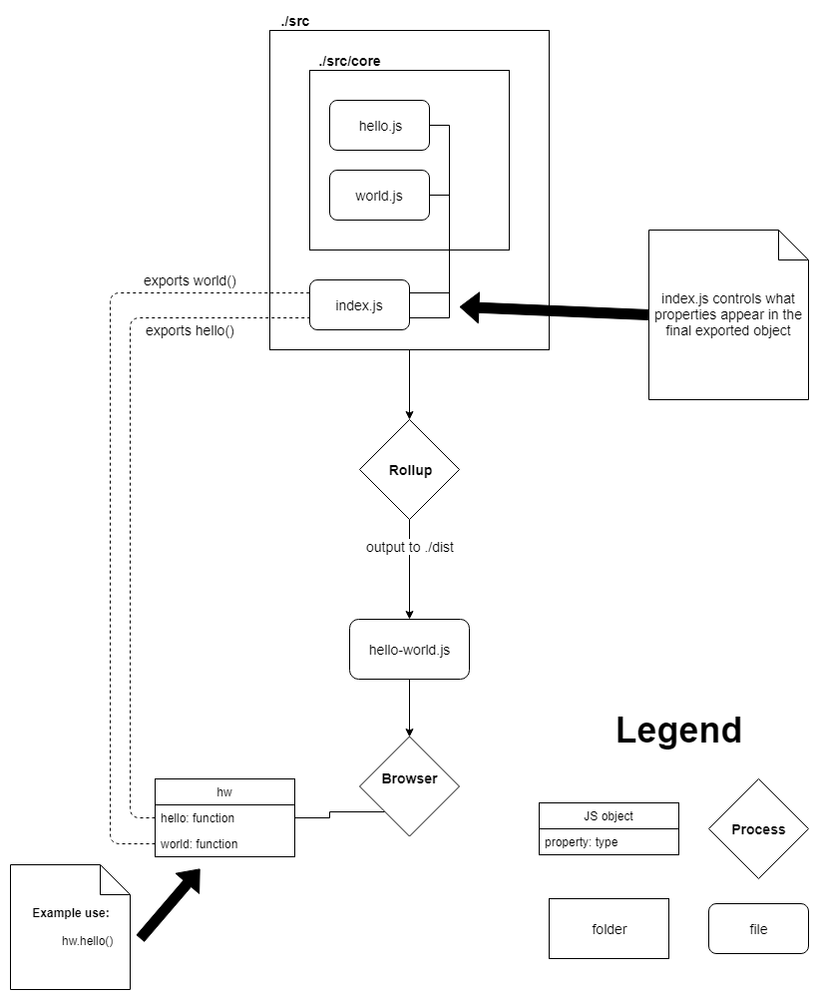

# JavaScript - Hello World ES6 Module

This repo is an experiment with ES6 modules, Rollup, and Babel.

#### Quick Reference for File Paths

    /   = Root directory
    .   = This location
    ..  = Up a directory
    ./  = Current directory
    ../ = Parent of current directory
    ../../ = Two directories backwards
    
Credit: [GibboK](https://stackoverflow.com/a/33774151/6591491).

## NPM

The highest level of configuration is made in `package.json`. This is a JSON file used to describe the core metadata about the project including its name and dependencies.

To install dependencies, open a terminal in the directory containing `package.json` and execute:

```bash
# 'i' is short for 'install'
npm i
```

### NPM Scripts

NPM controls the build process through scripts defined in `package.json` and through universal NPM commands such as `npm install`.

```js
// package.json
"scripts": {
  "dist": "rollup -c",
  "postdist": "npm run test",
  "test": "node ./test/test.js",
  "web": "python -m http.server --bind 127.0.0.1"
},
```

There are three scripts defined above: `dist`, `postdist`, `test`, and `web`. They can be executed in the terminal with `npm run <script name>`.

- `npm run dist`

This command runs rollup with the configuration flag. Rollup automatically looks for `rollup.config.js` and starts bundling the code in `./src`. The finished bundle is placed in `./dist`.

- `postdist`

This command automatically runs after the `dist` command has finished. It runs tests on the newly generated bundle. How? NPM [magic](https://docs.npmjs.com/misc/scripts).

- `npm run test`

This command has Node execute `./test/test.js`.

- `npm run web`

This command gets Python to spin up a simple server available at [localhost](127.0.0.1). There you will find `index.html` which imports `hello-world.js` in a script tag.

## Rollup

Rollup is a module bundler. Unlike most programming languages, JavaScript has not always had a native mechanism for importing and exporting code. In languages like Python, importing a function defined in another file is as simple as `import <module_path>`. Getting similar functionality in JavaScript requires the use of a bundler like Rollup.

### Rollup Plugins

Three plugins are used:

- [rollup-plugin-node-resolve](https://github.com/rollup/rollup-plugin-node-resolve)

Node-resolve allows Rollup to `import` modules from NPM. This allows you to `npm install` a package and use it in your library.

- [rollup-plugin-commonjs](https://github.com/rollup/rollup-plugin-commonjs)

Most packages distributed on NPM are [in CommonJS format](https://rollupjs.org/guide/en#rollup-plugin-commonjs). This plugin converts CommonJS modules to ES6, so they can be bundled with Rollup.

- [rollup-plugin-babel](https://github.com/rollup/rollup-plugin-babel)

The Babel plugin simplifies the interaction between Babel and Rollup. More on Babel later.

### ES6 `import` and `export`

The unusual history of JavaScript's module feature has resulted in [unusual syntax](http://2ality.com/2014/09/es6-modules-final.html) and debates (e.g. [named-exports vs default-exports](https://news.ycombinator.com/item?id=15765409)). To learn more about JavaScript modules, refer to:

- [Modules (Chapter 10 of Eloquent JavaScript)](https://eloquentjavascript.net/10_modules.html)

- [ECMAScript 6 modules: the final syntax](http://2ality.com/2014/09/es6-modules-final.html)

- [Rollup Guide](https://rollupjs.org/guide/en)

## Babel

[Babel](https://babeljs.io/) is a JavaScript transpiler. It takes modern JavaScript and converts it into JavaScript that can run in older browsers. Auto-updating browsers like Chrome and Firefox constantly receive the latest features standardized by [TC-39](https://www.ecma-international.org/memento/tc39-rf-tg.htm), but *some* browsers are slow to change (cough Safari cough) or never receive any updates at all (Internet Explorer). Babel allows developers to write cutting-edge JavaScript that still works on ancient web browsers.

For example:

```js
var a = 2;
var b = 3;

// Using a template string (not supported in IE 11)
console.log(`${a} + ${b} = ${a + b}`);
// >>> 2 + 3 = 5
```

Throw this into [Babel's repl](https://babeljs.io/repl) and out comes:

```js
var a = 2;
var b = 3;

// The template string has been replaced with string concatenation
console.log(a + " + " + b + " = " + (a + b));
```

### Syntax Transformation vs Polyfills

Not everything can be transformed. Template strings are really just a cleaner way of doing something that JavaScript could already do. Features that add new functionality, such as Promises, can't be patched so easily. Weird metaphor incoming: if you think of a browser as a wall, Babel can re-arrange the stuff that's already on the wall but it cannot fill cracks or holes. This is where pollyfills come in.

A polyfill is code that implements a missing feature. For example, Stefan Penner's [ES6 Promise](https://github.com/stefanpenner/es6-promise) library provides a polyfill for, you guessed it, [ES6 Promises](http://www.ecma-international.org/ecma-262/6.0/#sec-promise-constructor). Running Penner's script ensures that any code on your site that uses Promises works on all browsers. If a browser supports Promises, the polyfill does not run. To go back to the analogy: polyfills seal up holes in browsers like Polyfilla seals holes on walls.

**Polyfills can be expensive**. Not in the monetary sense, but in disk size. Without polyfills, the `hello-world.js` bundle in `./dist` is 1 KB. With all polyfills, the size is 207 KB. For comparison, jQuery is 86.3 KB. That may not sound like a lot, but it can add up if your website is already bringing in lots of other JS libraries and CSS. You also need to consider users with data caps browsing on underpowered devices over slow connections. To get file sizes down, only polyfill features that you actually need. If you don't care about supporting Internet Explorer 8, don't include polyfills for it. In a similar vein, only polyfill features that you use.

## Rollup - The Big Picture

The `./src` directory contains the `hw` module. The module name is set in `./rollup.config.js`, which has been set to pull the NPM package name specified in `./package.json`. The properties of the module are controlled by `./src/index.js`; the functions exported by this file will be available through `hw.<function_name>`. Functions aren't the only thing you can export, variables work too.

Rollup bundles all of the code in the `src` folder into a single `hello-world.js` file located in `./dist`. Add this file with a script tag and `hw` will be added to the global scope:

```html
<script src='./dist/hello-world.js'></script>
<script>
  console.log(hw);
  // >>> {hello: ƒ, world: ƒ, __esModule: true}

  console.log(hw.hello(), hw.world());
  // >>> By the way, the answer is 42
  //     hello world
</script>
```

Or require `hello-world.js` and use it with Node:

```js
const hw = require('../dist/hello-world.js');

console.log(hw);
// >>> { hello: [Function: hello], world: [Function: world] }

console.log(hw.hello(), hw.world());
// >>> By the way, the answer is 42
//     hello world
```

The following diagram tries to show how the final exported object, `hw`, is built.



Note that this is just one way to structure a module. Go out and look at other modules to see different patterns. For instance, D3.js is composed of many modules each with its own repo. The main D3.js repo has one `index.js` which [re-exports all of them](https://github.com/d3/d3/blob/master/index.js) under the `d3` global reference.
